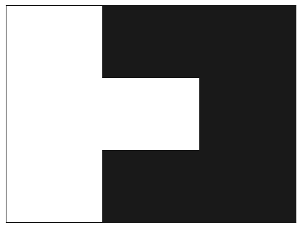
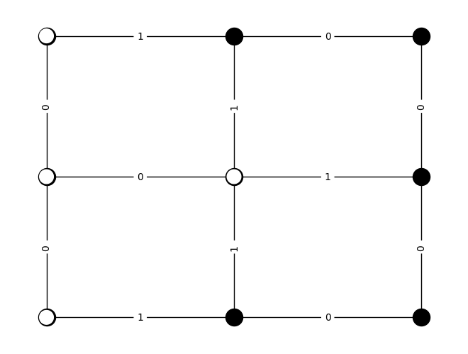
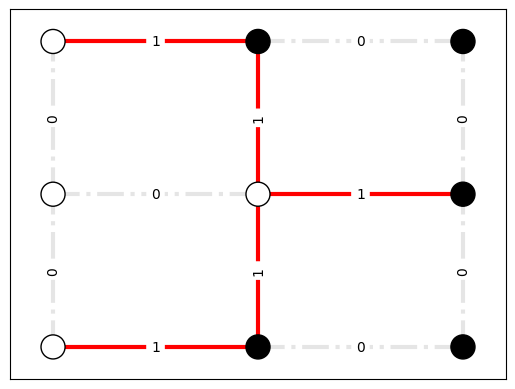
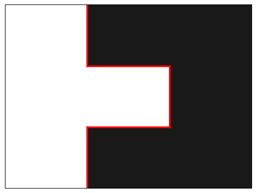

# The Boundary Problem

Given the grid of black and white squares below, how can we identify a good boundary line between the two colors?

## Problem Set Up

To solve this problem, we represent the image as a weighted graph. We create a node for each square in the image and an edge between adjacent squares, we can weight the edge using the absolute value of the color difference. With just two colors, this means that if adjacent squares are the same color then the edge has weight 0, and if the adjacent squares are different colors then the edge has weight 1.

With the problem represented as a graph, we are now looking to solve a variation of the weighted maximum cut problem. In particular, we want to:

- Have as many high-value edges 'cut' by the boundary line
- Have as many 0-valued edges 'uncut' by the boundary line

An optimal solution to this problem represented as a graph is shown below.

Translated back to our original grid of squares, this solution is shown below.

## The Exercise

In class we reviewed the components of the objective function for this problem. In the main program file called `boundary.py`, a few sections have been left for you to complete.

1. In the `build_bqm` function, fill in the two components of the objective function and add them to the BQM.
2. In the `run_on_qpu` function, adjust the parameters for chain strength and number of runs until you obtain the optimal solution.
